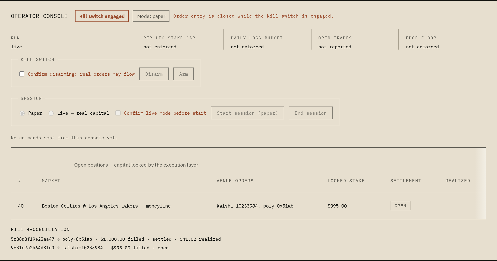
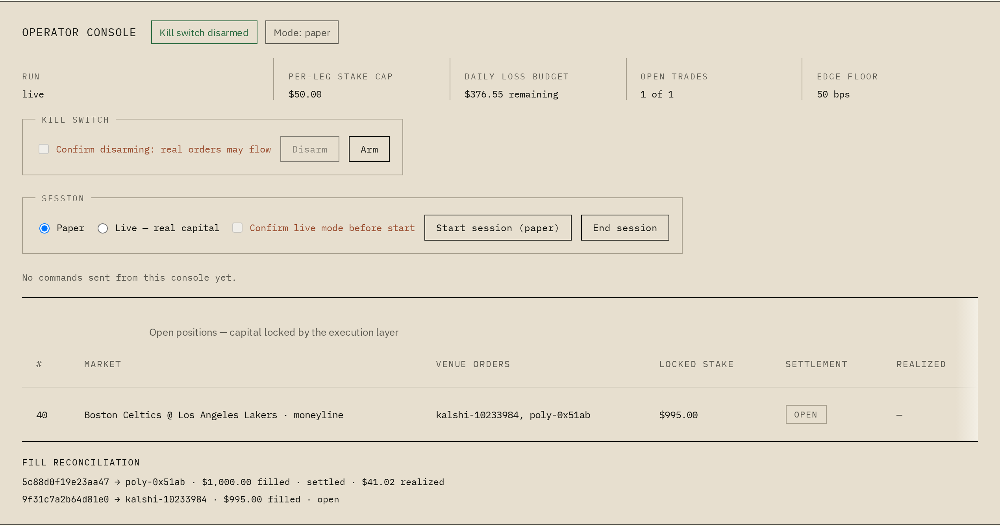

# Live trading integration

This document describes the opt-in execution boundary added to `arbkit`. It
is an implementation guide, not evidence that live orders have been placed.
The repository still treats paper results and live results as separate claims.

## Safety model

The detector and engine remain network-free. Live I/O begins only after a
`SignalEvent` has crossed the engine's signal ring:

```text
WebSocket feeds -> FeedEvent ring -> Engine -> SignalEvent ring
                                                  |
                                                  v
                                           RiskGate -> HedgedExecutor
                                                        |
                                              venue adapters / ledger
```

The default posture is safe:

- `arbkit-feed` live connectors are behind the `live` feature.
- `arbkit-exec` defaults to `DryRun`.
- `RiskConfig::default().kill_switch` is `true`.
- The example binary refuses live mode while `ARBKIT_KILL_SWITCH` is active.
- The dashboard's operator channel is guarded by its own secret
  (`LIVE_OPERATOR_TOKEN`); holding the runner's ingest token does not confer
  the right to command, and the console fails inert when disconnected.
- No credentials are stored in Rust source, `.env.example`, or the dashboard.
- `arbkit-core` and the engine hot loop do not depend on Tokio, HTTP, or venue
  authentication.

To enable a real deployment, an operator must explicitly provide credentials,
construct venue adapters, set conservative limits, validate the market catalog,
and disable the kill switch. That operational step is intentionally not part
of CI or the default example.

## Crate responsibilities

### `arbkit-feed`

With `--features live`, the crate exposes:

- `KalshiLiveFeed`, subscribing to Kalshi order-book deltas.
- `PolymarketLiveFeed`, subscribing to Polymarket market-channel updates.
- `MpscFeedBridge` and `spawn_ring_bridge`, which move parsed `Copy`
  `FeedEvent` values from async tasks to the synchronous SPSC producer.

The connectors reconnect after transport failures. Parser sequence gaps emit a
halt/stale event so the engine suppresses signals until a fresh snapshot
restores the book. Tape recording remains available at the feed boundary for
same-tape paper/live comparison.

### `arbkit-match`

`VenueInstrumentMap` is a startup-time catalog. A pair becomes active only if:

1. Both instruments resolve to the same canonical market.
2. They belong to different venues.
3. Their `MarketKind` values match.
4. Their `OutcomeSide` values are exact opposites according to
   `validate_binary_pair`.

Polymarket decimal token IDs are converted to a fixed `[u8; 32]` form by
`parse_poly_token_id`; no floating-point conversion is used. Unmatched or
ambiguous markets must be omitted from the active map and are never eligible
for execution.

Live identifier alignment (verified against the public APIs, Aug 2026):

- Kalshi event tickers stamp the season year first:
  `KXMLBGAME-26AUG241840TBDET-TB` reads `[YY][MMM][D]{1,2}[HHMM]` plus two
  variable-length team codes (2–3 letters each). Dates canonicalize to
  `YYYY-MM-DD`. Shapes that admit no such reading are malformed, never
  guessed at a split point.
- Kalshi's REST filter takes `status=open`, but returned records stamp
  themselves `status:"active"`; both spellings count as tradable.
- The MLB roster carries all 30 live team codes including two-letter ones
  (`AZ`, `KC`, `SD`, `SF`, `TB`) that a fixed 3+3 split cannot parse. Bare
  city names that two franchises share inside one league are deliberately
  absent from the alias table.

### `arbkit-feed` discovery

`live::discovery` builds a catalog generation over plain REST:

- A Polymarket proposition binds each CLOB token to a club through its own
  outcome label (`outcomes[i] ↔ clobTokenIds[i]`), so listing order can never
  flip sides. The title must name exactly the titled clubs; a label outside
  the title's pair is skipped as inconsistent, not reoriented.
- Every proposition also carries the game's US Eastern calendar date,
  converted from Gamma's UTC `gameStartTime`. Pairing requires the exact
  same date on the Kalshi side, so a stale listing cannot bind to a later
  rematch between the same clubs, and same-day doubleheaders stay distinct
  via the uniqueness check.
- One canonical market accepts exactly one Polymarket binding; a mirrored
  duplicate is counted and dropped instead of silently overwriting.
- Discovery URLs may be pinned to a series or tag
  (`--kalshi-markets-url='…markets?series_ticker=KXMLBGAME'`,
  `--poly-events-url='…events?tag_slug=mlb'`); the builder respects an
  existing query string. Unscoped defaults page through everything open on
  the venue and are noise for cross-venue work.


### `arbkit-exec`

The execution crate contains the application-boundary contracts:

- `ExecLeg` — venue, instrument, limit price, stake, and idempotency key.
- `RiskConfig` — per-leg stake cap, daily loss cap, open-trade cap, edge floor,
  and kill switch.
- `RiskGate` — reserves per-venue capital before submission and releases it on
  a failed hedge.
- `VenueAdapter` — the seam for a venue's authenticated FOK/IOC API.
- `DryRunAdapter` — deterministic, no-I/O adapter for tests and warm-up runs.
- `HedgedExecutor` — submits both legs, requires complete fills, and unwinds
  accepted legs when either side rejects or partially fills.
- `LiveProofReport` and `compare_tape` — integer-cent/basis-point proof data.

Adapters own authentication, request signing, venue order IDs, and venue-
specific unwind behavior. They should never be called from the engine thread.
Every live adapter must preserve idempotency using `ExecLeg::client_order_id`.

## Execution lifecycle

```text
1. Receive SignalEvent from the signal ring.
2. Convert its plan into exactly two ExecLeg values.
3. Validate edge, caps, loss budget, open-trade count, and bankroll.
4. Reserve both venue balances.
5. Submit both FOK/IOC orders at the detected limit prices.
6. If both fully fill, emit a live record with settlementStatus=open.
7. Otherwise cancel/flatten every accepted leg and emit live_phantom evidence.
8. Reconcile venue fill/settlement streams and update authoritative cents.
```

The `HedgedExecutor` stays synchronous at its trait seam so it can be tested
without a runtime, but submits both legs **concurrently**. It spawns the two
scoped adapter threads and joins them, so neither leg is priced against a
book that moved during the other's round-trip — the sequential two-call
pattern is no longer on the execution path. A production runner should call it
from its own execution task, off the engine hot loop; the engine contract does
not change.

## Dashboard wire contract

Live records extend the existing trade record with optional fields:

| Field | Meaning |
| --- | --- |
| `executionMode` | `paper` or `live` |
| `venueOrderIds` | Venue-assigned order IDs for accepted legs |
| `filledStakeCents` | Authoritative filled stake |
| `settlementStatus` | `open`, `settled`, or `unwound` |
| `realizedProfitCents` | Integer cents; nullable until settlement |

The worker accepts and relays these fields. It does not reconstruct live PnL
from prices or recompute venue fees. The dashboard displays an explicit
“Live Trading: real capital, not synthetic” banner when a live record is
present; paper sessions retain their existing synthetic-workload warning.

Two further runner frames carry the operator surface's data:

| Frame | Meaning |
| --- | --- |
| `risk` | The runner's authoritative posture: execution mode, kill switch, per-leg stake cap, daily loss budget (used and total), open-trade count and cap, edge floor. A cap the runner does not enforce is serialized as `null` and rendered as "not enforced" — never replaced with a client-side default. |
| `fills` | Fill events keyed by the execution layer's `clientOrderId` (venue order ID once assigned), with filled stake, settlement status, and realized cents only once settlement reports them. |

`session-start` additionally states `executionMode` up front, so paper vs.
live is explicit before any order can flow.

## Operator interface

The live view carries an operator console for driving and supervising
sessions. Authority stays on the runner side by construction:

- **Command path.** The console POSTs to `/api/live/command`, guarded by
  `LIVE_OPERATOR_TOKEN` (distinct from `LIVE_INGEST_TOKEN`). The worker
  validates every body against a zod schema (`session-start` with explicit
  mode, `session-end`, `kill-switch`) and queues it; the runner pulls queued
  commands from `/api/live/commands?afterId=<highWater>` and applies them
  through its own `RiskGate` → `HedgedExecutor` seam. A `202` from the worker
  means *queued*, never applied — the runner's next `risk` frame is the only
  confirmation that counts.
- **Disarm is double-gated.** A disarming command must carry an explicit
  `confirm: true`; the worker's schema rejects a bare disarm with `400`, and
  the runner independently refuses one too, so a defect on either side cannot
  arm real order flow silently. Every applied kill-switch command lands in
  the runbook log with a UTC timestamp, the command id, and the operator
  identity from `ARBKIT_OPERATOR_ID` (the shared bearer token carries no
  per-user identity, so the variable is the honest record — it defaults to
  `unknown-operator` rather than a fabricated name).
- **Kill-switch posture.** The switch starts engaged, mirroring
  `RiskConfig::default()`. The engaged state renders even while
  disconnected; order entry exists only on an open connection with the
  runner itself reporting disarmed; disarming requires an explicit
  confirmation. A disconnected console fails inert: cached state may be
  looked at, never acted through.
- **Session controls.** Start requires an explicit mode choice (paper vs.
  live, with live demanding its own confirmation), and the current `runId`,
  mode, and risk configuration are shown before any order can flow. End
  flows through the runner's graceful shutdown path. One process is one
  session: the runner opens it at launch with a fixed venue profile, so a
  matching `session-start` is acknowledged as already running and a
  mismatched one is refused by name (restart to change profile).





The screenshots are regenerated from scripted worker frames against the real
built app (`npm --prefix dashboard run shots`); every number in them comes
out of the same validated reducer a live session uses.

## Configuration

Copy `.env.example` into an operator-managed environment and replace blanks
with secrets supplied by a secret manager. Important defaults are:

```text
ARBKIT_KILL_SWITCH=1
ARBKIT_MAX_STAKE_PER_LEG_CENTS=5000
ARBKIT_MAX_DAILY_LOSS_CENTS=50000
ARBKIT_MAX_OPEN_TRADES=1
ARBKIT_MIN_EDGE_BPS=50
```

The worker adds two secrets of its own, never stored in the repo:

```text
LIVE_INGEST_TOKEN    # runner → worker ingest and command pull
LIVE_OPERATOR_TOKEN  # operator console → worker command path
```

### Secret handling (no key leakage)

Credentials come from an operator-managed secret manager injected into the
process environment at runtime — systemd `LoadCredential`/`EnvironmentFile`
outside the repo, a wrapper that reads from the manager's CLI, or an
equivalent. They are never committed, never written to `.env`, and never
pasted into shells whose history is recorded:

- `.env.example` ships every credential field blank; a test pins this.
- The Kalshi signing key must be mounted owner-readable (`0600`); the runner
  refuses a group/world-readable key before parsing it.
- Adapter `Debug` output redacts every secret field; only public identifiers
  (wallet address, base URLs) render.
- Before order flow starts and again at shutdown, the runner sweeps its own
  artifacts — the risk snapshot and the execution journal — for its
  credential values (key ids, API keys/secrets/passphrases, L1 key, PEM
  body lines, stream token). A hit aborts with exit code 9 naming the
  artifact and credential label, never the value.
- Proof artifacts are covered by the same rule; verify after any session:
  ```bash
  grep -rF -e "$KALSHI_ACCESS_KEY_ID" -e "$POLY_API_SECRET" \
      prod-session.ndjson prod-risk-state.json occurrences.ndjson live-proof.json
  ```
  Every listed file may be absent except when the corresponding tool ran;
  any match is a leak and a stop-the-line event.

The example command is intentionally a policy check:

```bash
cargo run -p arbkit-exec --example live_trader -- --mode=dry-run
```

It does not create venue clients or place orders. The production runner is a
separate, feature-gated process (see below).

## Production runner

`prod_trader` is the assembled live process. It wires real feeds, the engine,
the risk gate, the hedged executor, and (in live mode) the authenticated
adapters into one supervised session. Operational procedures — start/stop,
kill-switch handling, stale-feed and stuck-unwind response, restart recovery —
live in `RUNBOOK.md`.

```bash
cargo run -p arbkit-exec --features runner --example prod_trader -- \
    --mode=dry-run \
    [--url=http://127.0.0.1:8787/api/live/ingest] [--token-env=LIVE_INGEST_TOKEN] \
    [--state=prod-risk-state.json] [--journal=prod-session.ndjson] \
    [--window-ms=250] [--windows=<n>] \
    [--kalshi-markets-url=<fixture-url>] [--poly-events-url=<fixture-url>]
```

Flags accept both `--flag=value` and `--flag value`; both spellings resolve
identically. A value-taking flag written bare with no following value is a
usage error (exit 2), never a silent default.
Pinned discovery URLs must carry only their scope — the runner appends its own
`status=open` / `closed=false&limit…` filters (finding F2).

What it does per session:

1. REST discovery builds the validated cross-venue catalog
   (`validate_binary_pair` remains the gate); an empty catalog refuses to run.
2. Live mode requires venue credentials, queries both venue balances before
   any order POST (a venue that cannot answer aborts the session), refuses to
   start while `ARBKIT_KILL_SWITCH` is engaged, and refuses to restart with
   unreconciled in-flight orders in the durable state. A stored snapshot also
   carries the risk policy that governed the money at risk: its limits
   (`stake`, `daily_loss_cap`, `open_trades_cap`, `min_edge`) win over this
   run's environment — any drift is printed, never silently applied — while
   the kill switch stays a live-env posture.
3. Feeds run as reconnecting Tokio tasks over an mpsc bridge into the SPSC
   ring; the engine hot loop stays on its own thread with no I/O.
4. The main loop drains signals, deduplicates, resolves plans through the
   catalog, and executes only fully-resolvable two-leg cross-venue plans
   through `RiskGate` → `HedgedExecutor`. Kalshi is always leg 0.
 5. Execution records journal to NDJSON; `session-start`/`risk`/`positions`/
    `stats`/`heartbeat`/`session-end` frames stream to the dashboard worker,
    and operator commands (`kill-switch`, `session-end`) are pulled and applied
    through the runner's own gate with UTC runbook timestamps.
 6. Risk state checkpoints to `RiskStateStore` after every execution; a final
    checkpoint lands on graceful shutdown.
 7. Each in-flight order is reconciled every window: the runner registers it
    before submission — in memory *and* durably, with a failed or partial
    persist rolling back so a plan is never transmitted unprotected —
    acknowledges the venue order id in both ledgers, polls venue status
    through a `SettlementSource` (an I/O-free seam), and applies terminal
    fills through the idempotent `ReconciliationLedger`. `fills` frames carry
    the settlement status and, once the venue reports them, realized cents;
    `risk.settle` is applied exactly once per terminal order, and the settled
    order is cleared from the durable state. A restart re-seeds in-flight
    orders so none are orphaned; the restart drill pins exact restoration,
    idempotent settlement by client order id, and that a checkpoint can
    never erase unacknowledged recovery state (`restart_drill.rs`).

8. Every executed signal freezes a detection-time occurrence record and
   graceful shutdown emits `live-proof.json`; `same_tape_proof --compare`
   then judges paper vs live with exit codes `0` (within tolerance), `1`
   (ROI falsified), and `2` (phantom-rate halt — live phantoms more than
   10 percentage points above the paper baseline).

### Runner exit codes

| Code | Meaning |
|---|---|
| 0 | session completed (graceful end or `--windows` limit) |
| 2 | bad arguments |
| 3 | live start refused: kill switch engaged |
| 4 | credentials missing/invalid, or balance query failed |
| 5 | discovery failure |
| 6 | live restart refused: unreconciled in-flight orders in durable state |
| 7 | market registration failure |
| 8 | journal/state/occurrence artifact could not be created |
| 9 | credential material detected in an artifact (names file + label) |

## Proof protocol

1. Run live feeds in dry-run for at least one representative slate.
2. Record the raw feed tape and verify mappings manually.
3. Run micro-stakes only after catalog and bankroll checks are reviewed.
4. Record attempted arbs, complete fills, phantoms, unwinds, fees, slippage,
   filled stake, and settled profit in integer cents.
5. Replay the same tape through the paper simulator.
6. Compare paper and live ROI in basis points using `compare_tape`.

A negative live ROI or high phantom rate is a valid result. It falsifies the
synthetic assumption and should be reported rather than hidden by recomputing
or relabeling the numbers.

### Same-tape proof procedure

The proof artifact pair is produced by two runs over one **occurrence tape** —
an NDJSON log with one record per detected signal, frozen at detection time
(`OccurrenceRecord` in `crates/arbkit-exec/src/proof.rs`): quoted plan, per-leg
stake/payout, arrival price, and arrival depth.

1. During a session, the runner writes `occurrences.ndjson` and, when it
   settles, its own counters as a `LiveProofReport` JSON artifact
   (`LiveProofReport::to_json`).
2. The identical tape is replayed through the paper simulator:

   ```bash
   cargo run -p arbkit-exec --features paper-replay --example same_tape_proof -- \
       --input occurrences.ndjson --compare live-proof.json --tolerance-bps 50
   ```

3. The tool prints a combined `{paper, live, comparison}` artifact and exits
   `0` inside tolerance, `1` when the tape is falsified (ROI divergence), or
   `2` on a phantom-rate halt — live phantoms more than 10 percentage points
   above the paper baseline. Exit code `1` or `2` on a real slate is a
   *finding*: paper results did not transfer, and every downstream claim must
   say so; re-arm the kill switch before any further session. Never tune
   tolerance until the check passes.

Replay semantics worth knowing before reading an artifact: a moved arrival
price on one leg does not produce a clean partial outcome — under the default
(chase-disabled) policy the other leg still fills alone, so the occurrence is
a phantom of the broken-leg kind and the report carries that directional loss
at full weight. That is the number paper trading exists to expose.

### Acceptance criteria

**Dry-run warmup (before any order is transmitted):**

- At least one full representative slate replayed dry-run with zero unwind
  failures and zero `ExecError::Unwind` reports.
- Failure-drill suite (`failure_drills.rs`) green against the deployed
  adapter build.
- Reconciliation ledger shows every acknowledged venue order ID matched to a
  client order ID; no orphaned in-flight entries after restart drills.

Procedure (the runner prints all of it):

```bash
cargo run -p arbkit-exec --features runner --example prod_trader -- \
    --mode=dry-run --windows=10 \
    --kalshi-markets-url='…markets?series_ticker=KXMLBGAME' \
    --poly-events-url='…events?tag_slug=mlb' \
    --tape=warmup-tape.bin --dump-catalog=catalog-dump.csv
```

- `--tape` records every raw feed event crossing the bridge (binary tape,
  replayable with the pipeline example); `--dump-catalog` writes one CSV row
  per leg — Kalshi ticker and Polymarket decimal token id — for manual
  mapping review against the venues.
- The session-end `warmup ledger:` line reports `unwind_failures`,
  `ack_matched`, `in_flight_remaining`, and `tape_events`. Zero unwind
  failures and zero-orphan in-flight (open ≠ orphaned: remaining orders were
  durably registered pre-submission and re-seed on restart) is the pass
  condition.
- Feeds need TLS (rustls) and, for Kalshi's market-data socket, signed
  credentials even in dry-run: `KALSHI_ACCESS_KEY_ID` +
  `KALSHI_PRIVATE_KEY_PATH`. Without them the Kalshi feed fails loudly
  (`401`) instead of silently delivering an empty book.

**Micro-live (first transmitted orders):**

- Kill switch disarmed by explicit operator action, recorded with timestamp
  and identity in the runbook log.
- Stake capped to the smallest tradeable increment times two contracts;
  daily loss budget no larger than one worst-case leg loss.
- Same-tape comparison executed after every session: |live ROI − paper ROI|
  within tolerance, else escalate and disarm.
- Phantom rate above the paper baseline by more than 10 percentage points
  halts micro-live until explained.

### Production readiness review (pre-capital checklist)

- [x] Credentials supplied by secret manager only; nothing in `.env`, shell
      history, dashboard code, or logs (adapters redact keys in `Debug`).
      (HJ-149: artifact sweeps, exit-9 contract, blank-env pin.)
- [x] `ARBKIT_KILL_SWITCH=1` verified as the resting posture; live mode
      refuses to start while engaged. (Rehearsed: exit 3, RESULTS.md §9.)
- [x] Catalog gate active: only pairs passing `validate_binary_pair` are
      executable; unmatched markets omitted, never traded on assumption.
      (HJ-146: 42-pair live catalog; fixture test pins it offline.)
- [x] Risk limits set deliberately (per-leg cap, daily loss cap, open-trade
      cap, edge floor) and persisted via `RiskStateStore`; restart drill
      restores bankroll and open trades exactly. (HJ-150 `restart_drill`.)
- [x] Adapter request timeouts configured; a stalled venue degrades to a
      phantom whose accepted leg is unwound (drill-pinned
      `failure_drills.rs`).
- [x] Runbook covers: session start/stop, kill-switch arm/disarm, stale-feed
      response, stuck-unwind reconciliation, restart recovery, and where the
      proof artifacts land — see `RUNBOOK.md`, rehearsed per `RESULTS.md` §9.
- [x] Falsification outcomes documented in RESULTS.md as dated rows —
      including negative ones — per the reporting rule above. (§9 session log
      and falsified-assumptions table.)

## Verification

The implementation is covered by:

```bash
cargo fmt --all --check
cargo clippy --workspace --all-targets --all-features -- -D warnings
cargo test --workspace --all-features
npm --prefix dashboard test -- --run
npm --prefix dashboard run build
npm --prefix dashboard run typecheck:worker
```

These checks use mocks, dry-run adapters, and local fixtures. They never place
live orders.

## Current boundary

The repository is **micro-live-ready**: the assembled runner carries a session
from REST discovery through a validated catalog, live feeds (TLS, signed
Kalshi market-data auth), risk-gated concurrent execution, durable state with
a rehearsed restart drill, occurrence capture and same-tape comparison, and
an audited operator command path. The pre-capital checklist in the proof
protocol above is fully ticked, with per-item evidence.

What remains is operator territory, not code: venue credentials registered
with Kalshi/Polymarket, the capital decision, and the first deliberate,
logged disarm of the kill switch before a micro-size order transmits — after
which every session gets a same-tape comparison and a dated row in
`RESULTS.md` §9. Operations procedures live in `RUNBOOK.md`; falsified
assumptions and honest zeros are recorded in `RESULTS.md` §9.
