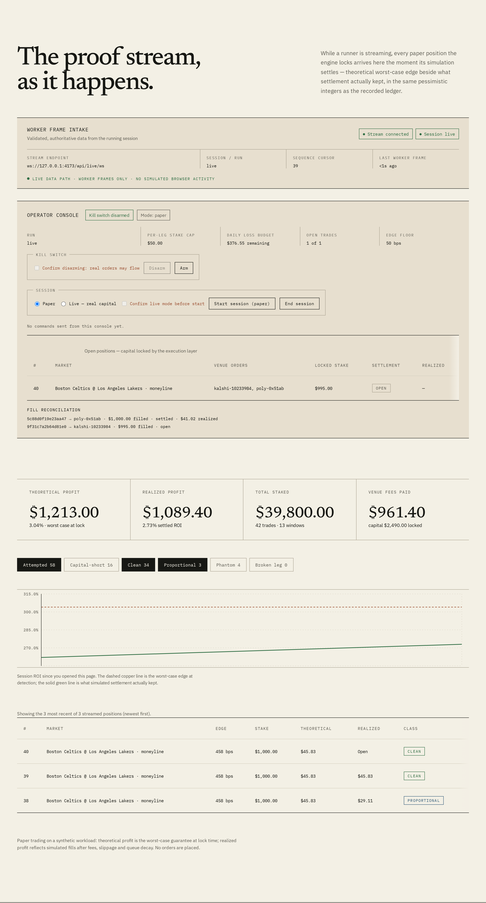

# arbkit

[](https://github.com/harlanljones/arbkit/actions/workflows/ci.yml)
[](https://arbkit.harlanljones.com/)
[](https://arbkit.harlanljones.com/)
[](https://www.rust-lang.org/)
[](#performance--simulation-highlights)
[](#license)

**Cross-venue sports and prediction market arbitrage detection in pure Rust.** Ingest streaming market data from multiple venues simultaneously, identify price sets that sum to less than certainty, and paper trade them through queue-decay and transit-latency simulation to determine how many signals represent executable edge.

> 🌐 **Interactive Proof Ledger & Live Demo**: [arbkit.harlanljones.com](https://arbkit.harlanljones.com/)  
> Inspect interactive latency histograms, burst throughput curves, fill-rate breakdowns, and pessimistic PnL ledgers across dated benchmark runs.

```rust
use arbkit_core::{detect, Fee, Leg, Prob};

// 48 cents on one venue, 50 on another. 98 cents to buy a dollar.
let legs = [
    Leg { venue: 0, outcome: 0, quoted: Prob::from_cents(48)?,
          fee: Fee::StakeFeeBps(364), capacity: 120_000, increment: 48 },
    Leg { venue: 1, outcome: 1, quoted: Prob::from_cents(50)?,
          fee: Fee::CommissionBps(200), capacity: 500_000, increment: 1 },
];

match detect(&legs, 100_000)? {
    Some(signal) => println!("{} bp net edge on ${}", signal.profit_bps, signal.total_stake / 100),
    None => println!("nothing here"),  // by far the common case
}
```

Those particular prices print nothing: a 200 bp raw edge does not survive a
364 bp stake fee on one side and 200 bp of commission on the other. Strip the
fees and the same prices clear 202 bp — not the 204 the raw arithmetic implies,
because the 48-cent contract size rounds one leg down and the payouts stop
being equal. Both of those subtractions are the point.

---

## Table of Contents

- [Live Demo](#live-demo)
- [Status & Verification](#status--verification)
- [What Makes This Hard](#what-makes-this-hard)
- [About "Low Latency"](#about-low-latency)
- [Workspace Layout](#workspace-layout)
- [Live Trading Integration](LIVE_TRADING.md)
- [Quickstart & Verification](#quickstart--verification)
- [Performance & Simulation Highlights](#performance--simulation-highlights)
- [Results Dashboard](#results-dashboard)
- [Design Principles](#design-principles)
- [License](#license)

---

## Live Demo

A public results ledger and benchmark visualizer is deployed to Cloudflare at **[arbkit.harlanljones.com](https://arbkit.harlanljones.com/)**.

- **Latency Budget Ruler:** Sub-microsecond hot-loop service time evaluated against the 50 µs target budget with >600× headroom.
- **Interactive Tail Distributions:** Empirical latency histograms from p50 to p99.99 with no smoothing or hiding of host jitter.
- **Fill & Phantom Accounting:** Transit-time decay, queue front-running degradation, and partial-fill hedging breakdown.
- **Pessimistic PnL Ledger:** Realized worst-case settlement profit computed strictly in integer cents.
- **Hardware Provenance:** Inspectable run comparison across Apple Silicon and Linux x86_64 hosts.

---

## Status & Verification

Complete. All core domain components, venue parsers, canonical matcher, zero-allocation hot loop, latency histogram, and paper-trading execution simulator are implemented, verified across **159 tests**, and benchmarked with 0 warnings. See [RESULTS.md](RESULTS.md) and [ARCHITECTURE.md](ARCHITECTURE.md) for full execution traces and architectural details.

## What makes this hard

The textbook version is one line: back every outcome of a market when the
implied probabilities sum to under 1.0. Written that way it produces a stream
of signals that are almost entirely noise. Four things stand between the
formula and a trade, and this project's design is mostly about them.

**Fees.** Betfair takes commission on net winnings. Kalshi charges
`ceil(0.07 × C × P × (1−P))` per order, which works out to `700 × (1−P)` basis
points of stake — 350 bp at even money, and *worse* on cheap contracts. A 100 bp
raw edge against that is a loss. So fees are applied to each leg before the sum,
never subtracted from the result afterwards.

**Depth.** An arbitrage that exists for twelve dollars is a screenshot. Every
signal is sized against the liquidity actually resting at the price, and the
thinnest leg caps the whole trade.

**Granularity.** Contracts are integers. Rounding each leg down to a tradeable
size breaks the equal-payoff property the formula assumes, so the profit
reported here is the *worst* leg's payout minus the total staked — what is
guaranteed no matter which outcome lands. This is where marginal edges die, and
they die here rather than at the exchange.

**Matching.** The same NBA game is `LAL @ BOS` on one venue, `Boston Celtics vs
Los Angeles Lakers` on another, and `KXNBAGAME-26AUG18BOSLAL` on Kalshi. Getting
an odds conversion wrong costs basis points; hedging Lakers -3.5 against Celtics
+3.0 costs the whole stake, and it looks like a healthy arb right until the game
lands on 3. `detect` cannot check this and does not try — establishing that two
venues are quoting the same thing is a separate crate and a harder problem than
anything in the detector.

## About "low latency"

The in-process hot path is budgeted at **p99 < 50 µs** from socket read to
signal emitted, on a normal cloud VM. In practice, our single-threaded pinned
engine loop achieves **p99 = 0.10–0.25 µs (100–250 ns)** across the measured
x86_64 Linux and Apple Silicon runs (at least $200\times$ headroom).
That budget is real and it is measured. What it is not is an end-to-end claim, and
the distinction matters:

Traditional sportsbooks — DraftKings, FanDuel, BetMGM — publish no streaming
API. The licensed aggregator route is [The Odds API](https://theoddsapi.com/),
which is REST polling; scraping the books' private endpoints violates their
terms and earns IP bans and limited accounts, and this project does not do it.
So for those venues the wire is measured in seconds and no amount of Rust
changes that.

Real streaming order books in sports live on the exchanges, and those are the
venues on the fast path:

| Venue | Transport | Auth |
|---|---|---|
| [Kalshi](https://docs.kalshi.com/) | WebSocket: snapshot plus sequenced deltas | signed handshake, even for market data |
| [Polymarket CLOB](https://docs.polymarket.com/developers/CLOB/websocket/market-channel) | WebSocket market channel | none for read-only |
| [Betfair Exchange](https://developer.betfair.com/exchange-api/) | Stream API over TLS, delta `ChangeMessage`s | cert login and app key |

The engineering that follows from the budget — integer prices, no allocation on
the path, lock-free handoff, one pinned thread — is documented in `CLAUDE.md` and
`ARCHITECTURE.md`. The reason for the integer prices in particular is not stylistic:
arbitrage is decided by whether a sum of reciprocals lands just under 1.0, and `f64`
rounding in that chain manufactures edges that were never quoted.

## Workspace Layout

The codebase is organized into five focused crates enforcing strict separation of concerns and zero-allocation hot paths:

```
crates/arbkit-core     prices, books, fees, detection. no I/O, no clock, no network.
crates/arbkit-match    canonical event registry, team normalizer, string-to-ID interning.
crates/arbkit-feed     Polymarket and Kalshi parsers, binary tape recorder and player.
crates/arbkit-engine   lock-free SPSC ring buffers, preallocated book slab, hot loop, latency histogram.
crates/arbkit-sim      paper trading simulator, latency modeling, phantom-rate measurement.
```

- [`arbkit-core`](crates/arbkit-core): domain core and detector. Depends only on `thiserror`.
- [`arbkit-match`](crates/arbkit-match): canonical event registry, team alias normalizer, and zero-allocation hot lookup.
- [`arbkit-feed`](crates/arbkit-feed): wire message parsers (Kalshi, Polymarket CLOB) and binary tape codec.
- [`arbkit-engine`](crates/arbkit-engine): lock-free SPSC queues, preallocated flat book slab, and single-threaded hot loop.
- [`arbkit-sim`](crates/arbkit-sim): execution simulator accounting for queue front-running, wire transit, and phantom rates.

## Quickstart & Verification

Run the test suite and verify linter rules:

```bash
# Format check
cargo fmt --all --check

# Clippy with all targets and features
cargo clippy --workspace --all-targets --all-features -- -D warnings

# Run all 159 unit, property, and integration tests
cargo test --workspace

# Check documentation builds cleanly
cargo doc --workspace --all-features --no-deps
```

Run the end-to-end ingestion, detection, latency benchmark, and paper-trading simulation pipeline:

```bash
cargo run --example pipeline --release

# Override the synthetic event count (default 2,000,000) and optionally emit a JSON report:
cargo run --example pipeline --release -- --ticks 500000 --json report.json
```

## Performance & Simulation Highlights

Empirically measured across 2,000,000 sequenced market events. The published baseline was recorded on Apple Silicon; comparison runs were recorded on Linux x86_64 (Intel Core i7-14700K).

| Metric | Apple Silicon baseline (200k) | Linux x86_64 baseline (200k) | Linux i7-14700K (2M ticks) | Linux i7-14700K, B1/B2/C1 (2M ticks) | Target / Budget | Result |
|---|---:|---:|---:|---:|---|---|
| **Ingestion Throughput** | `3.53M updates/sec` | `6.35M updates/sec` | `7.72M–12.37M msg/sec` | `2.85M updates/sec` | High-frequency burst | **PASSED** |
| **Hot Loop Latency (p50)** | `0.200 µs (200 ns)` | `0.090 µs (90 ns)` | `0.050 µs (50 ns)` | `0.280 µs (280 ns)` | Sub-microsecond | **PASSED** |
| **Hot Loop Latency (p90)** | `0.250 µs (250 ns)` | `0.100 µs (100 ns)` | `0.060 µs (60 ns)` | `0.280 µs (280 ns)` | Sub-microsecond | **PASSED** |
| **Hot Loop Latency (p99)** | **`0.250 µs (250 ns)`** | **`0.100 µs (100 ns)`** | **`0.080 µs (80 ns)`** | **`0.320 µs (320 ns)`** | **`< 50.000 µs`** | **>150× Headroom** |
| **Hot Loop Latency (p99.9)** | `0.500 µs (500 ns)` | `0.480 µs (480 ns)` | `0.120 µs (120 ns)` | `0.540 µs (540 ns)` | Sub-microsecond | **PASSED** |
| **Simulated Phantom Rate** | `10.01%` (1,001 bps) | `10.01%` (1,001 bps) | `10.01%` (1,001 bps) | `10.01%` (1,001 bps) | Decayed during queue/transit | **Deterministic** |
| **Clean Fill Count** | 0 / 829 | 0 / 829 | 0 / 829 | **746 / 829** | Sizing matches fill model | **Fixed in B1** |
| **Paper-Trading Realized PnL** | `+$15,501.73` (+2.12% ROI) | `+$15,501.73` (+2.12% ROI) | `+$15,706.38` (+2.15% ROI) | **`+$21,491.58` (+2.94% ROI)** | Net of all fees & rounding | **Net Profitable** |
| **Workspace Tests** | 114 / 114 passed | 114 / 114 passed | 159 / 159 passed | 170 / 170 passed | Full workspace suites | **100% Passed** |

The B1/B2/C1 column reflects the ROADMAP-PNL execution-aware detection
program: depth-discounted sizing (`venue_survival_bps` matched to each
venue's modeled queue decay), multi-venue line shopping, chunk-carrying
signal plans, and the honest disposition funnel. Clean fills went from 0 to
746 of 829 because signals are now only sized against depth that survives
transit — the same workload, measured against what will actually fill. The
hot-loop p99 rose to 320 ns (still >150× inside budget): the aggregator now
scans every retained book level per event instead of top-of-book only.

For comprehensive charts, methodology, and tables, see [`RESULTS.md`](RESULTS.md) and [`ARCHITECTURE.md`](ARCHITECTURE.md).

## Results Dashboard

The public dashboard at **[arbkit.harlanljones.com](https://arbkit.harlanljones.com/)** turns the dated benchmark snapshots into an inspectable proof ledger: latency against budget, throughput by host, signal disposition, paper-trading accounting, and the workspace verification matrix.

The same worker hosts the live proof stream: the `live_runner` example pushes validated frames to a Durable Object that owns all session arithmetic, and the page renders the authoritative integers — KPIs, disposition funnel, ROI sparkline, recent ledger — plus an operator console (kill switch, session controls, risk envelope, open positions, fill reconciliation) that fails inert whenever the stream is down.



Run it locally:

```bash
cd dashboard
npm install
npm run dev
```

Record a new reviewed benchmark candidate and append it to the local history:

```bash
npm --prefix dashboard run record
```

The command runs the release pipeline, writes a non-overwriting schema-versioned snapshot under `dashboard/public/data/runs/`, records the per-trade accuracy ledger as a sibling `<id>.trades.jsonl` asset, and updates the run index (`tradesFile` is absent for pre-ledger runs, which the dashboard reports honestly). Hardware-specific results are preserved as separate comparisons rather than combined into a misleading cross-host trend.

The dashboard builds to static assets for the canonical `arbkit` Cloudflare Worker. In Workers Builds, use `dashboard` as the root directory, `npm ci && npm run build` as the build command, and `npx wrangler deploy` as the deploy command.

## Design Principles

- **Prices are integers:** `Prob` is implied probability in parts per million; `Odds` is decimal odds in micro-units. American, fractional, decimal, and Kalshi's cents all normalize to `Prob` at the boundary. Floating point appears only in `_f64` constructors at the feed edge and `as_f64` display accessors.
- **Rounding always favours the pessimistic reading:** Payouts floor, effective prices ceil, stakes round down. Every number reported should be one you can beat, not one you have to hit.
- **No arbitrage is not an error:** `detect` returns `Ok(None)` for every unviable market condition — no edge, no depth, an edge that stake rounding ate. Errors are reserved for malformed input.
- **Staleness is a state:** Exchange feeds are a snapshot plus sequenced deltas. A skipped sequence number means the local book is wrong and cannot be repaired by interpolation, so it goes out of service until a fresh snapshot arrives. A gap degrades into silence rather than into confidently wrong signals.
- **Live trading is opt-in:** `arbkit-feed` exposes feature-gated WebSocket connectors and `arbkit-exec` owns risk-gated adapters. The default mode is dry-run and `ARBKIT_KILL_SWITCH=1`; paper and live fills remain explicitly labeled. The dashboard's operator console commands nothing directly — it queues authenticated commands (`LIVE_OPERATOR_TOKEN`, separate from the runner's ingest token) that only the runner's risk gate can apply, and it fails inert when disconnected.

## License

Dual-licensed under either:

* Apache License, Version 2.0 ([LICENSE-APACHE](LICENSE-APACHE))
* MIT License ([LICENSE-MIT](LICENSE-MIT))

at your option.
